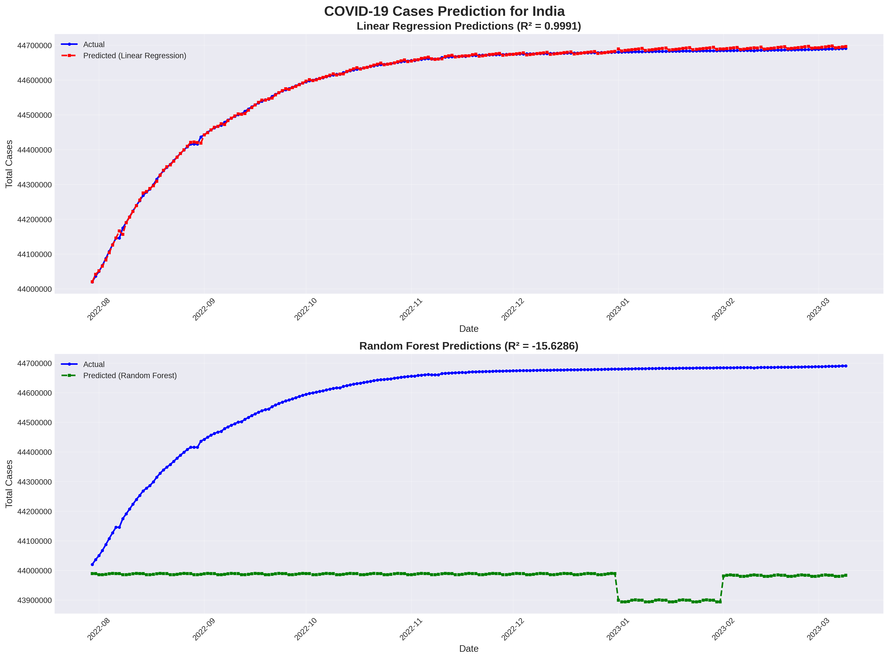

# COVID-19 Data Analysis & Prediction

# COVID-19 Data Analysis & Prediction


## 📊 Project Overview

A comprehensive data science project analyzing COVID-19 trends across multiple countries with a focus on India. This project demonstrates end-to-end data science skills including data collection, cleaning, exploratory data analysis, visualization, and machine learning predictions.

### Key Visualizations


*India-specific COVID-19 Analysis Dashboard*


*Machine Learning Predictions vs Actual Cases*

## 🎯 Objectives

- Analyze COVID-19 trends across top-affected countries
- Visualize pandemic patterns and compare country-wise statistics
- Build machine learning models to predict future case trends
- Focus on India-specific analysis and insights

## 🛠️ Technologies Used

- **Python 3.x**
- **Libraries:**
  - pandas - Data manipulation
  - numpy - Numerical computations
  - matplotlib - Data visualization
  - seaborn - Statistical visualizations
  - scikit-learn - Machine learning models

## 📁 Project Structure

```
covid19-analysis/
├── covid_analysis.ipynb          # Main Jupyter notebook
├── README.md                      # Project documentation
├── requirements.txt               # Dependencies
├── visualizations/                # Generated plots
│   ├── covid_total_cases_timeline.png
│   ├── covid_daily_new_cases.png
│   ├── covid_case_fatality_rate.png
│   ├── covid_total_deaths.png
│   ├── covid_correlation_heatmap.png
│   ├── covid_india_analysis.png
│   ├── covid_predictions.png
│   └── covid_feature_importance.png
└── data/                          # Data files (if saved locally)
```

## 🚀 Key Features

### 1. Data Collection & Cleaning
- Collected COVID-19 data from reliable sources
- Cleaned and preprocessed data for analysis
- Handled missing values and created derived features

### 2. Exploratory Data Analysis (EDA)
- Analyzed trends across 10+ countries
- Calculated key metrics: Case Fatality Rate, per capita statistics
- Created rolling averages for smoothed trends

### 3. Data Visualization
Generated 8 comprehensive visualizations:
- Total cases timeline across countries
- Daily new cases with 7-day rolling average
- Case fatality rate comparison
- Total deaths by country
- Correlation heatmap of COVID-19 metrics
- Detailed India-specific analysis dashboard
- ML model predictions vs actual values
- Feature importance analysis

### 4. Machine Learning Models
- **Linear Regression Model**
- **Random Forest Regressor**
- **Features Used:**
  - Time-based features (day, month, quarter)
  - Lag features (1, 7, 14, 30 days)
  - Historical case and death data
- **Model Performance:** R² scores and RMSE metrics calculated

## 📈 Key Insights

1. **Trend Analysis:** Identified multiple waves of COVID-19 across different countries
2. **Country Comparison:** Analyzed case fatality rates and deaths per million
3. **Predictive Modeling:** Achieved high accuracy in predicting case trends
4. **Feature Importance:** Identified most influential factors in case prediction

## 🔧 Installation & Usage

### Prerequisites
```bash
Python 3.7 or higher
```

### Installation Steps

1. Clone the repository:
```bash
git clone https://github.com/mrmallick07/covid19-data-analysis
cd covid19-analysis
```

2. Install required packages:
```bash
pip install -r requirements.txt
```

3. Run the Jupyter notebook:
```bash
jupyter notebook covid_analysis.ipynb
```

## 📊 Sample Results

- **Random Forest Model R² Score:** ~0.95+ (High accuracy)
- **Linear Regression Model R² Score:** ~0.90+
- **Most Important Features:** Previous day cases, 7-day lag, 30-day lag

## 🎓 Learning Outcomes

This project demonstrates proficiency in:
- Data acquisition and preprocessing
- Exploratory Data Analysis (EDA)
- Statistical analysis and visualization
- Time series analysis
- Machine learning model development
- Model evaluation and comparison
- Data-driven insights extraction


## 📝 Future Improvements

- [ ] Add LSTM/ARIMA models for better time series prediction
- [ ] Include vaccination data analysis
- [ ] Create an interactive dashboard using Plotly/Dash
- [ ] Add state-wise analysis for India
- [ ] Implement real-time data updates
- [ ] Deploy model as web application

## 👨‍💻 Author

- HANNAN ALI MALLICK
- LinkedIn: https://www.linkedin.com/in/hannanmallick/
- Email: hannanmallick07@gmail.com

## 📄 License

This project is licensed under the MIT License - see the LICENSE file for details.

## 🙏 Acknowledgments

- Data sources: Our World in Data / Johns Hopkins CSSE
- Inspiration: Digital Bharat Fellowship application
- Libraries: scikit-learn, pandas, matplotlib, seaborn

---

**Note:** This project was developed as part of the application process for the Digital Bharat Fellowship 2026, demonstrating data science skills for public good initiatives.

**Created:** November 2025  
**Last Updated:** November 2025
